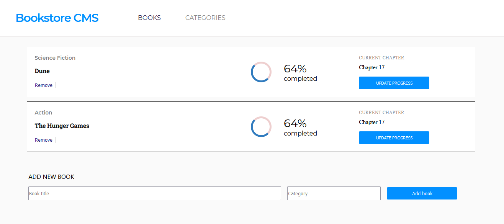

# Bookstore CMS

This is a React and Redux project that allows users to add and remove books from the Bookstore. It fetches data from the [Bookstore API](https://www.notion.so/Bookstore-API-51ea269061f849118c65c0a53e88a739) which allows for adding and deleting of books as well. The adding and monitoring progress part is soon to be added.

 

## Built With

- React
- Redux
- [Bookstore API](https://www.notion.so/Bookstore-API-51ea269061f849118c65c0a53e88a739)

## Getting Started

To get a local copy up and running follow these simple example steps.
- Clone the repository with:
`git clone https://github.com/blakbox23/bookstore.git`

- Install dependencies by running:
`npm install`

### Usage
To run the app in your machine, run `npm start`

## Authors

👤 **Peter Mbuthia**

- GitHub: [@Blakbox23](https://github.com/blakbox23)
- Twitter: [@blakbox23](https://twitter.com/blakbox23)
- LinkedIn: [Peter Mbuthia](https://www.linkedin.com/in/peter-mbuthia)

## 🤝 Contributing

Contributions, issues, and feature requests are welcome!

Feel free to check the [issues page](https://github.com/blakbox23/bookstore/issues).

## Show your support

Give a ⭐️ if you like this project!

## Acknowledgments

- Hat tip to anyone whose code was used
- Inspiration
- etc

## 📝 License

This project is [MIT](./MIT.md) licensed.
